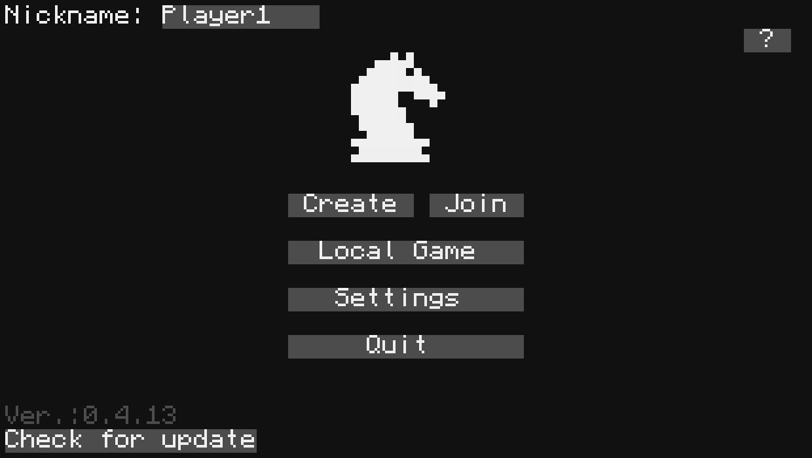
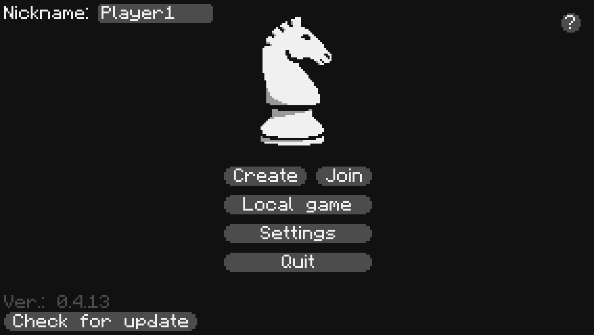
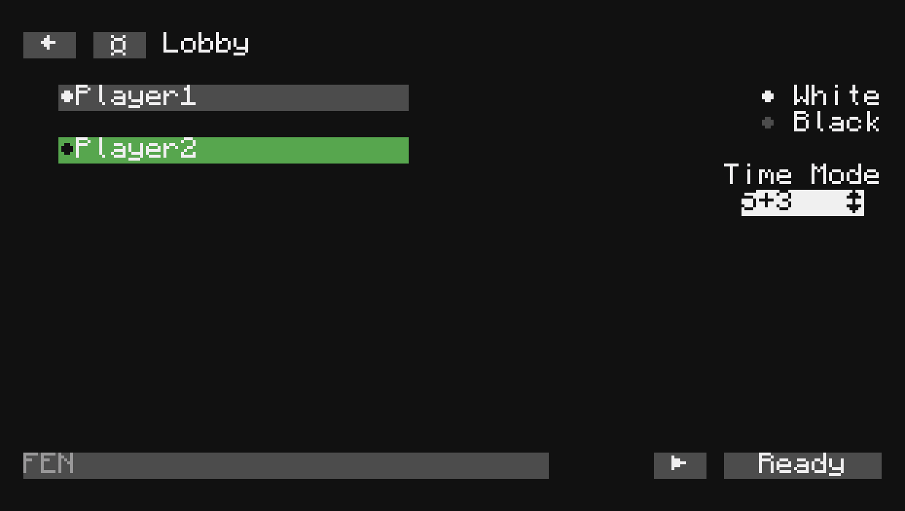
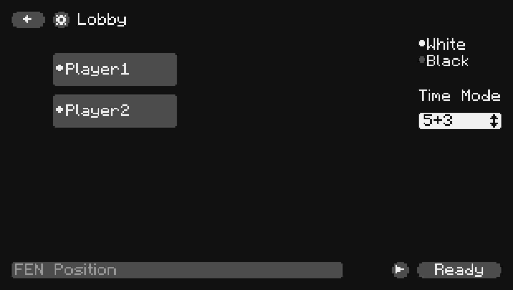
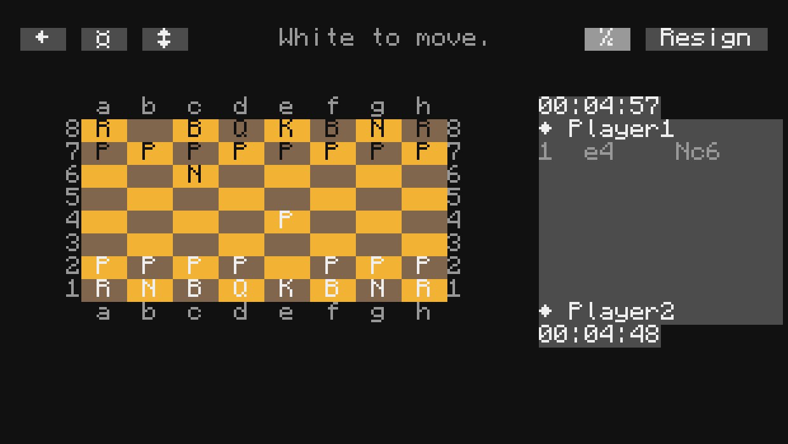
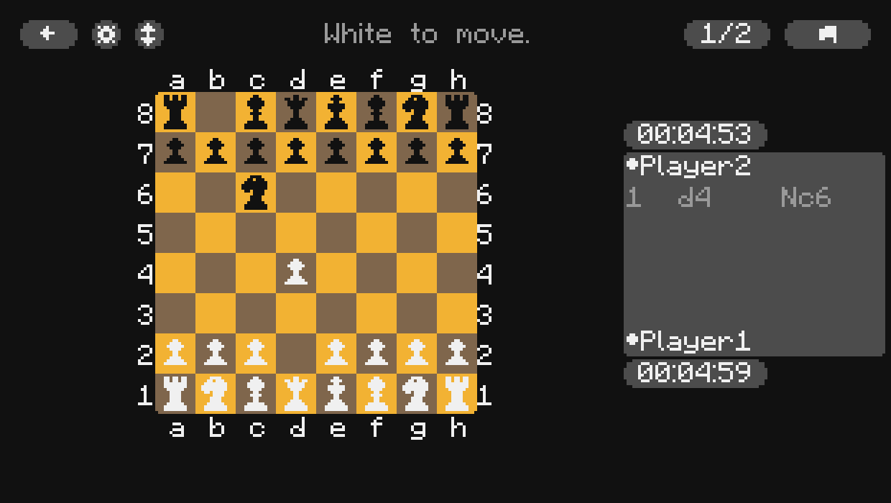

# ♟️ Chess for ComputerCraft

[](https://www.lua.org/)
[]([https://computercraft.info/](https://tweaked.cc/))
[](https://github.com/aTimmYm/Chess/tree/dev)

**Full-featured chess right inside Minecraft!**
Play locally or online with friends on ComputerCraft computers.

<div style="display: flex; flex-wrap: wrap; gap: 20px; justify-content: center;">

  <div style="text-align: center; flex: 1 1 45%; max-width: 480px;">
    
    
  </div>

  <div style="text-align: center; flex: 1 1 45%; max-width: 480px;">
    
    
  </div>

  <div style="text-align: center; flex: 1 1 45%; max-width: 480px;">
    
    
  </div>

</div>

## ✨ Features

- 🎨 **Two display modes**:
  - Graphical (GM) — beautiful large interface
  - Text (TM) — works on regular monitors
- 🌐 **Multiplayer** over Rednet and WebSocket
- ♟️ **10+ board color themes** (Ocean, Forest, Night, Candy, etc.)
- 🔠 **Two piece styles** — letters or beautiful symbols
- 🔊 **Sound effects** for moves, captures and checkmate
- 🌍 **Three languages**: Russian, Ukrainian, and English (in Graphical Mode)
- ⚙️ **Flexible settings** (volume, nickname, output device)

## 🚀 Installation

On your Computer run:

```lua
wget run "https://raw.githubusercontent.com/aTimmYm/Chess/refs/heads/dev/installer.lua"